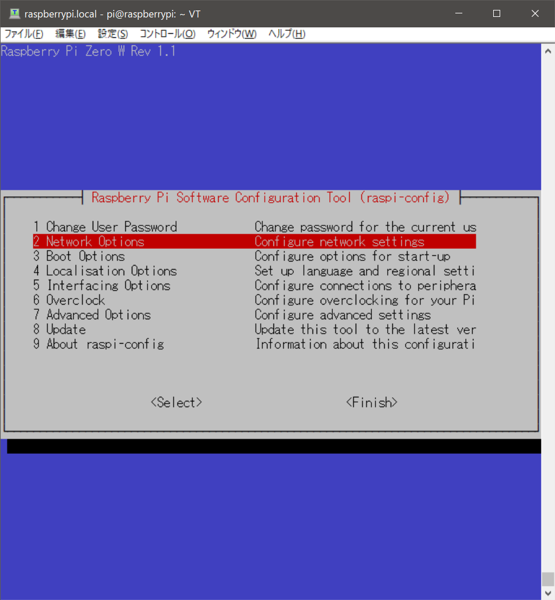
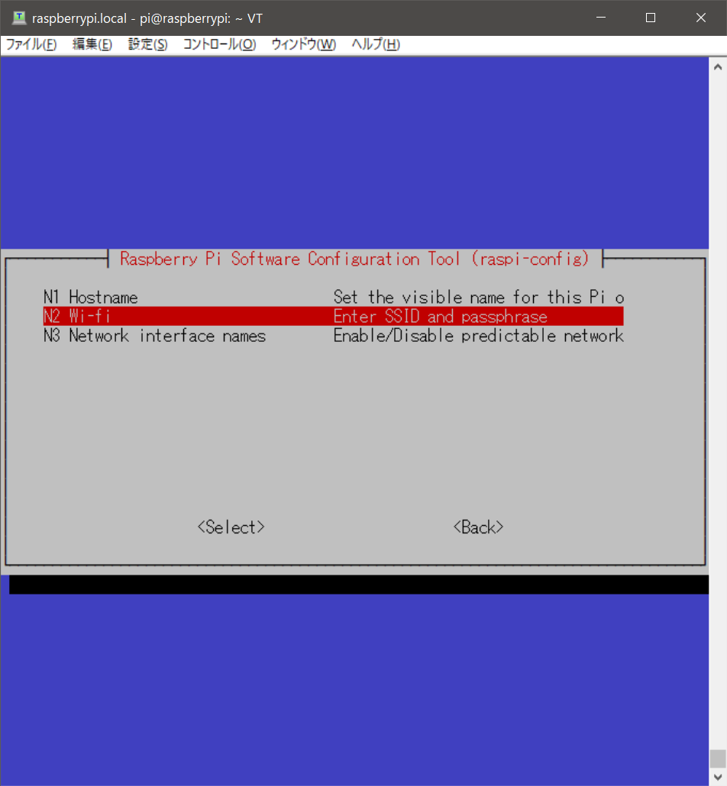

## Hello, World!
OSをインストールしたので、先ずはお決まりのHello, World!をやってみる。
[この記事](https://qiita.com/hikida/items/c6124ce960e8004c3957)を参考。

### Wi-Fiにつなげてみる
下記手順でWi-Fiに接続。

1. 下記コマンドを実行。

```
raspi-config
```

2. 下記メニューが出てくるので、"2 Network Options"を選択。


3. "N2 Wi-fi"を選択。


4. SSIDとPasswordを入力。

5. DHCP/IPの設定。(IPアドレスを固定。)
> DHCPでIPが変わると面倒なのでIPを固定します。
> 
> ```
> # 例
> cat << EOS >> /etc/dhcpcd.conf
> interface wlan0
> static ip_address=172.17.1.113/16
> static routers=172.17.0.1
> EOS
> ```

### Raspbianの初期設定
以下の様にミドルウェアをインストール。
管理者権限(sudo)をつけてやりましょう。
<pre/>
UNIXは"sudo -s"で管理者権限そのままいけるけど、RasberryPi OSはどうなのかな。
</pre>

```
sudo apt-get update
sudo apt-get upgrade
sudo apt-get install vim git
```

- vimとgitをインストールしようとしたところで、下記のメッセージが出力される。
  ので、指示通り'sudo dpkg --configure -a'を実行してみる。
  - 解決されたぽい。
```
E: dpkg was interrupted, you must manually run 'sudo dpkg --configure -a' to correct the problem.
```

- 有名なエラーらしい、[この記事](http://tamazonr.hatenablog.com/entry/2015/09/03/205817)を参考。

### ソースコードを書いてGit経由でチェックアウト(クローン)させる
いつもこの方法でRasberry Piへダウンロードさせるわけではないけど、初回だけお試し。

1. ここのリポジトリをクローン。
   UsernameやPasswordを要求された場合はGitHubのアカウント通りに入力。
  ```
  git clone https://github.com/hlowin/RasberryPi.git
  ```

2. ブランチを切り替え。
   branch ledへ切り替えておく。
```
cd RasberryPi/
git checkout led
```

3. ホストの方でソースコードを作成。
   


