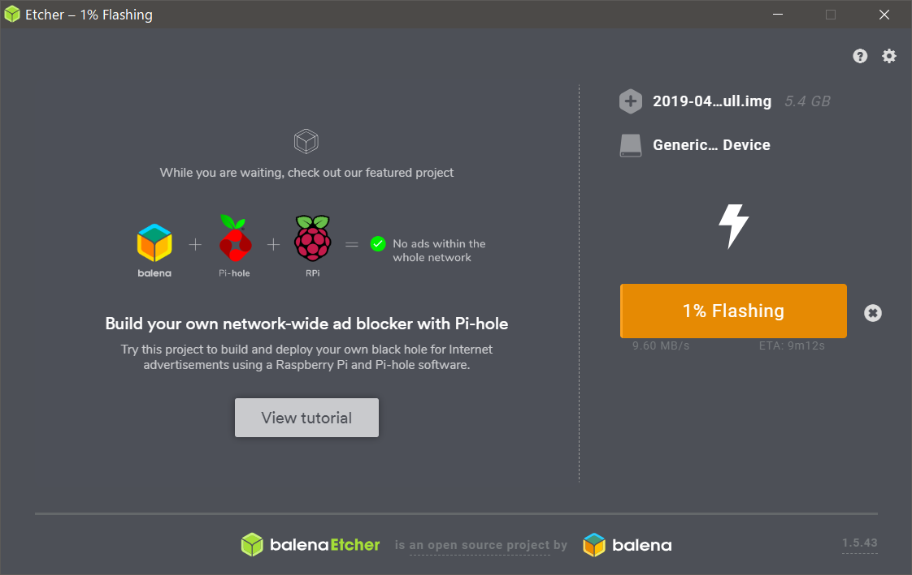
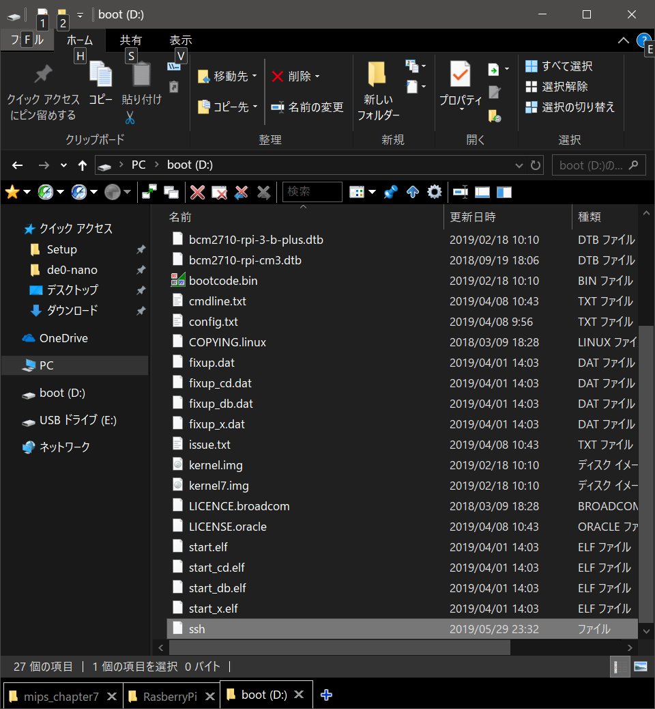
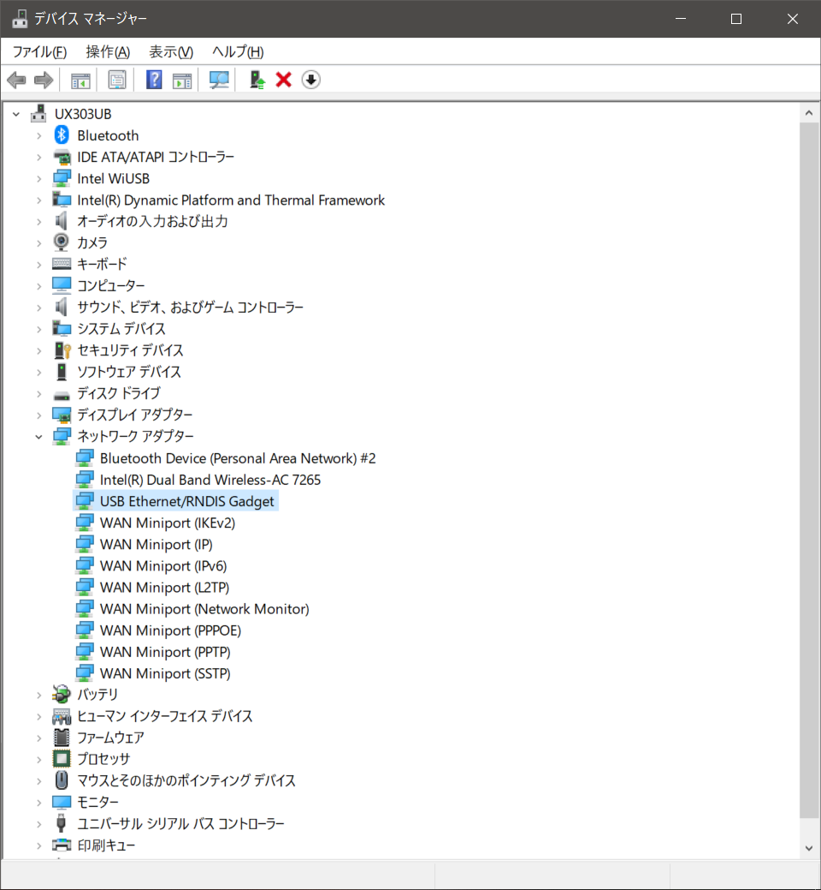
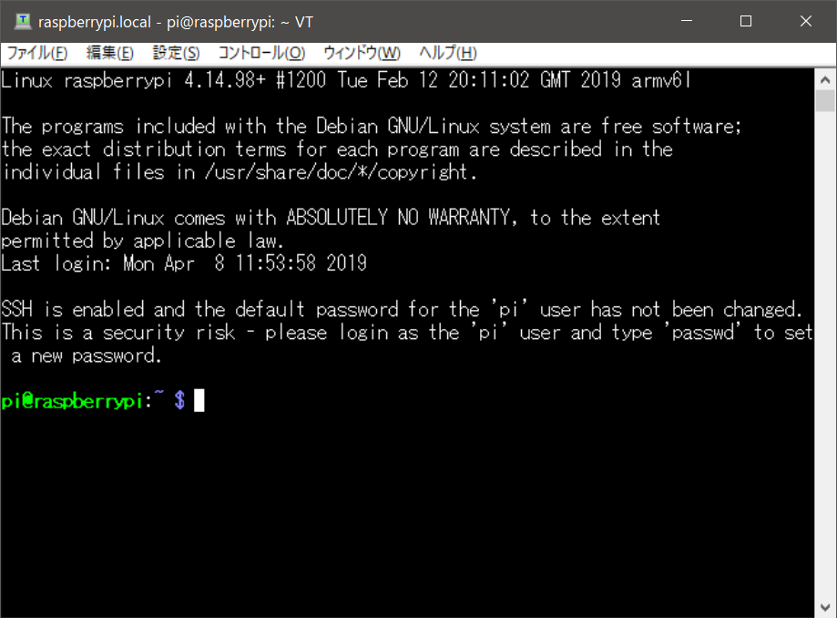

## Rasbbery Pi Zero Wをいじる

前職の友人がマイコンとプラレールでビジネスをしたいと錯乱していたため興味を持ち、Rasbbery Pi Zero Wで遊べる環境を作ってみる。
Branch LEDでは7セグLEDを制御するところまでを目標。

### OSをインストール
[この記事](https://qiita.com/hishi/items/8bdfd9d72fa8fe2e7573)を参考に作業。
[この記事](https://qiita.com/msquare33/items/dc6fc9098f50d9b9dbf2)も参考に。

[ここ](https://learn.adafruit.com/introducing-the-raspberry-pi-zero/setting-up-your-sd-card)からOSイメージをダウンロード。
Qiitaの記事はOS Xを使用しているため、balenaEtcherを使用する方向でインストールする。

1. Making an SD Card – Using Windows

2. balenaEtcherをダウンロード。

3. インストール。

4. 下記様な画面が表示される。
  

5. OSイメージを拾ってくる。
  [RasberryPi公式サイト](https://www.raspberrypi.org/downloads/)から拾ってくる。
  - "Raspbian"の方をダウンロード。
  - 恐らく"Raspbian Stretch with desktop and recommended software"でよいと思われる。

6. .zipをEtcher上でロードさせて、ROM焼するドライブを選んでWriteする。

7. ROM焼き中。
  

8. 完了したら、ドライブを抜いて再度刺す。

9. bootドライブが出てくるので、直下に"ssh"というからファイルを作成。
  

10. cmdline.txt修正
  - 下記のようにやっておく。
  
> bootドライブのcmdline.txtに "modules-load=dwc2,g_ether" を追加する。
> rootwaitとquietの間に挿入。

11. config.txt修正
  - 下記のようにやっておく。

> bootドライブのconfig.txtの末尾に "dtoverlay=dwc2" を追加。

12. RPI Driver OTGインストール
  - 下記のようにやっておく。
> 「[Raspberry Pi Zero を USB ケーブルだけでセットアップする](http://marrone.jp/labo/?p=1586)」の手順に従って、RPI Driver OTGをインストール
> http://domotique.caron.ws/wp-content/uploads/telechargement/RPI%20Driver%20OTG.zip
> これをやっておかないと、USB経由でRaspberry Pi Zeroにアクセスができない

  - bonjourインストール
    - ~~めんどくさいので、iTunesをインストールするか…~~
      ~~[Apple公式](https://www.apple.com/jp/itunes/download/)よりダウンロード & インストール。~~
      嘘らしい、[ここ](https://support.apple.com/kb/DL999?locale=ja_JP)からダウンロード&インストール。

  - TeraTermインストール
    [窓の社](https://forest.watch.impress.co.jp/library/software/utf8teraterm/)からインストール。
    
  - RPI Driver OTGインストール
    [ここ](https://caron.ws/diy-cartes-microcontroleurs/raspberrypi/pi-zero-otg-ethernet/)にドライバが置いてあった。
    "Télécharger les drivers suivant: RPI Driver OTG"のところ。
    [ここ](https://qiita.com/Liesegang/items/dcdc669f80d1bf721c21)を参考にドライバを更新。
    
    最終的に下記のような感じになる。
    

13. Rasberry PiへSDを挿入して、USB-PCと接続。
  - 緑LEDが点灯する様になるまで待つ。

14. SSH接続
  - 1.～13.の手順でSSH接続できました。
    